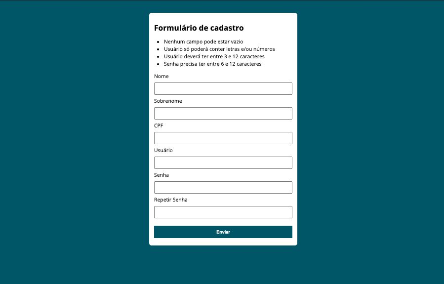

<div align="center">
  <h1>Formulario CPF</h1>
  <p>Formulário de validações feito em HTML, CSS e JavaScript.</p>
  
</div>

---
<h3 align="center">
  <a href="https://cleilsonandrade.github.io/Formulario_CPF/">Acessar demonstração</a>
</h3>


## Índice

* [Descrição](#descrição)
* [Techs](#techs)
* [Design](#design)
  * [Cores](#cores)
  * [Tipo de fonte](#tipo-de-fonte)
* [Instalação](#instalação)
* [Links Contato](#links-contato)
* [Licença](#licença)

# Descrição
Aplicação foi desenvolvida com HTML, CSS e a linguagem JavaScript pura.

# Techs: 
- **HTML**
- **CSS**
- **JavaScript**

# Design:
- O modelo final para desktop está disponível na pasta `./design`

## Cores:
- #115666<br>
- #093038<br>
- red<br>
- #fff<br>
- #000<br>

## Tipo de fonte:
- **Open Sans**, **sans-serif**

# Instalação:
```bash
  # Clone este repositório:
  $ git clone https://github.com/CleilsonAndrade/Formulario_CPF
  $ cd ./Formulario_CPF
```

# Links Contato
- **Linkedin:** https://www.linkedin.com/in/cleilson-andrade/<br>
- **GitHub:** https://github.com/CleilsonAndrade<br>

# Licença
<p align="center"><a href="https://github.com/CleilsonAndrade/Formulario_CPF/blob/master/LICENSE"></a></p>
